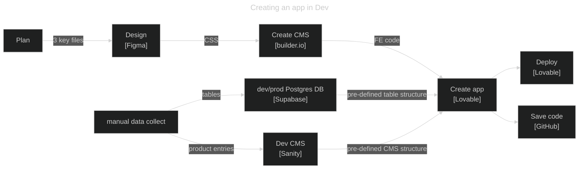

**Purpose** This is the workflow for site creation and update


# Workflow



## Ideate
_I think this is what's missing. Ideate on a live prototype quickly without AI credits and stuff._


## Plan
Create the following documents
* Initial AI prompt: description of the project and how it works
* Guidelines.md: guidelines the AI should follow when building
* DesignSystem.md: details on styling


## Design
Use Figma AI to create pixel-perfect clickable prototype


## Data input
Use Claude to define Supabase (data tables) and Sanity (product info and pictures) data structures.
Use CLI + scripts to upload to Sanity.
Use CLI + scripts to upload to Supabase

## Front end code generation
Use Builder.io to generate the front end code. It is integrated with both Figma and Lovable to create code compatible with Lovable.


## App generation
Use Lovable to generate the app from 1. builder.io front end code, supabase table structure, and sanity cms structure.

## Dev Deploy
Deploy dev version directly with Lovable. 

## Github
Save code to github. Push to prod repo manually. 

## Prod Deploy
Deploy from github to vercel


# Prompts and commands

## Initial Dub Merch creation 

```
Create a react-native website called "Dub Merch". It is a site that showcases Professional Womens Basketball Player Merchandise. It is not an ecommerce site. It is a site that aggregates the best Merchandise from Player and other sites. 

Create a home page. 

The header area should be as follows: Include the Logo large at the top. Include the tagline in small font in the top left of the page. The tagline is "Buy from the ballers, not the suits."

The body consists of images of player merchandise. Photos should be very large and take up a significant portion of the screen. Include 3 rows of 3 photos. Photo dimensions should be close to 3:4 in landscape orientation. Every photo is a different item. The caption should include the [player name] and [item name]. The combination of player name and item name will be unique to each item. Each item should also have hashtags. The hashtags will include the team the player plays on. We may add more hashtags later. The body should have infinite scroll functionality rather than pages. Meaning if we later have 18 images, you will just scroll down to see them rather than using page navigation. 


* Use a standard react file structure with a src/ folder that contains source code, css code, figma components and imports. Also use a public folder which holds an images folder which stores images.
* Turn SGV images to Typescript files rather than keeping them as images.
* The logo to include is in the figma file. 
* The color scheme is as follows: 
- Primary Purple: #330432
- Primary Blue: #003153  
- Primary Pink: #CE7994
- Background: #fae5da
- Accent Blue: #21AAE2


Create a product item page. Each of the 9 items from the home page should have a product item page. You navigate to the product item page by clicking either the produc timage or product caption. The product item page should contain 4 images. Please use any women's basketball-related images for this. The product item page should have the Product title again and then a short description about the product. Use lorem ipsum text for now. 

Create a Guidelines.md file that I can use to update with design guidelines.


```